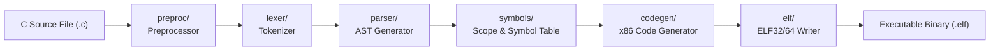

<!-- SPDX-License-Identifier: GPL-2.0-only -->

# Keira C Compiler (`kcc`) Architecture

`kcc` is a native, self-hosting C compiler designed to run directly within Keira Ring 3 (`userland/bin/kcc/`).

---

## Compiler Pipeline

---

## Submodule Documents

| Document | Focus Area | Description |
| :--- | :--- | :--- |
| [`preproc.md`](preproc.md) | Preprocessor | Macro expansion, `#include` resolution, conditional compilation (`#ifdef`) |
| [`lexer.md`](lexer.md) | Lexical Analysis | Stream tokenization, keywords, numeric/string literals, operators |
| [`parser.md`](parser.md) | AST Construction | Recursive descent parser, grammar rules, expression operator precedence |
| [`codegen.md`](codegen.md) | Machine Code Generation | x86 target code emission, register allocation, stack frame layout |
| [`elf.md`](elf.md) | ELF Object Generation | Direct generation of statically linked ELF32/64 binary executables |
