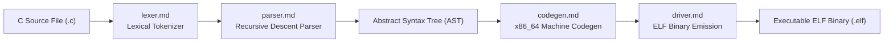

<!-- SPDX-License-Identifier: GPL-2.0-only -->

# In-Kernel Keira C Compiler (KCC) Architecture

This submodule details the internal architecture of `kcc.elf`, the standalone in-kernel C compiler capable of compiling C programs directly into native executables.

---

## Compilation Pipeline

---

## Compiler Submodule Index

| Component | Document | Description |
| :--- | :--- | :--- |
| **Lexer** | [`lexer.md`](lexer.md) | Keyword recognition, string literal escape processing, and numeric tokens |
| **Parser** | [`parser.md`](parser.md) | Recursive descent grammar parser and AST node construction |
| **Code Generator** | [`codegen.md`](codegen.md) | x86_64 machine code generation, stack frame setup, and register mapping |
| **Driver & CLI** | [`driver.md`](driver.md) | Compiler command line arguments, target specifications, and ELF output |
