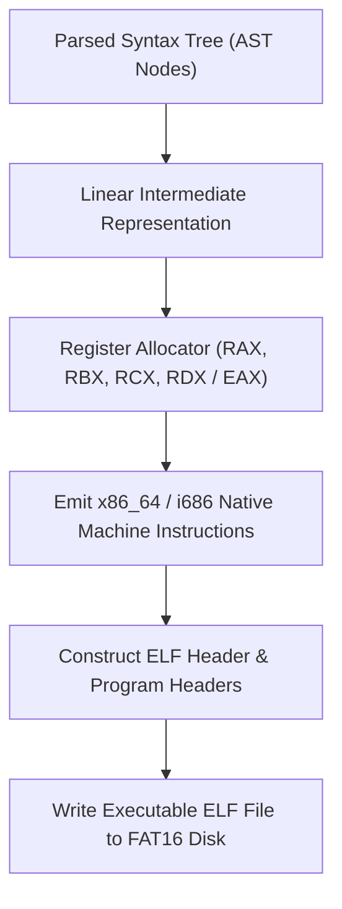

<!-- SPDX-License-Identifier: GPL-2.0-only -->

# KCC Machine Code Generator & ELF Emission

This document specifies the abstract syntax tree (AST) code generator, register allocator, and 32/64-bit ELF binary emission engine in `kcc`.

---

## Code Generation Pipeline



---

## Technical Specifications

| Architecture | Target Format | Calling Convention |
| :--- | :--- | :--- |
| **x86_64** | 64-bit ELF (`ET_EXEC`, Machine `0x3E`) | System V AMD64 ABI (`RDI`, `RSI`, `RDX`, `RCX`, `R8`, `R9`) |
| **i686** | 32-bit ELF (`ET_EXEC`, Machine `0x03`) | cdecl / System V i386 ABI (Stack-passed arguments) |

---

## Core API (`user/bin/kcc/codegen.c`)

```c
void emit_func_prologue(void);
void emit_func_epilogue(int is_main);
void emit_inc_local(int offset, int is_post, int is_dec);
void emit_inc_global(int offset, int is_post, int is_dec);
int write_elf_executable(const char *output_path);
```
