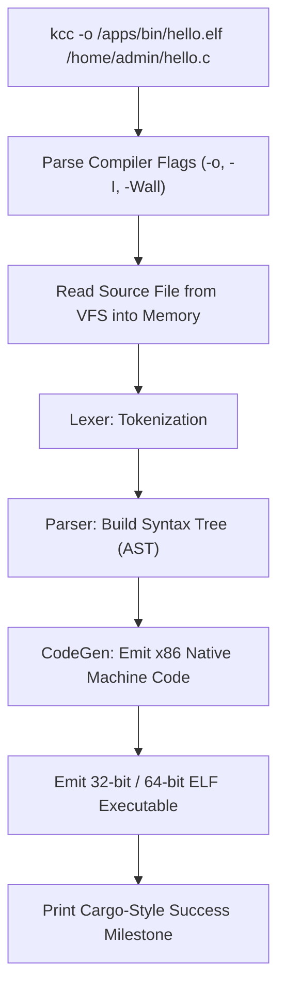

<!-- SPDX-License-Identifier: GPL-2.0-only -->

# KCC Command Line Compiler Driver

This document specifies command-line option parsing, preprocessor invocation, multi-stage compilation orchestration, and error reporting in `kcc`.

---

## Compilation Orchestration Flow



---

## Technical Specifications

| Option | Flag | Description |
| :--- | :--- | :--- |
| **Output File** | `-o <path>` | Specifies target executable path (e.g. `/apps/bin/prog.elf`) |
| **Include Path** | `-I <dir>` | Adds header search directory (default `/system/sdk/include`) |
| **Help** | `-h`, `--help` | Displays compiler usage and supported options |

---

## Shell Usage

```bash
# Compile native C program inside Keira shell using KCC binary and CLI arguments
keira> run /apps/bin/kcc.elf /apps/src/calc.c -o /apps/bin/calc2.elf

# Execute compiled ELF binary in Ring 3 userland
keira> run /apps/bin/calc2.elf
```
