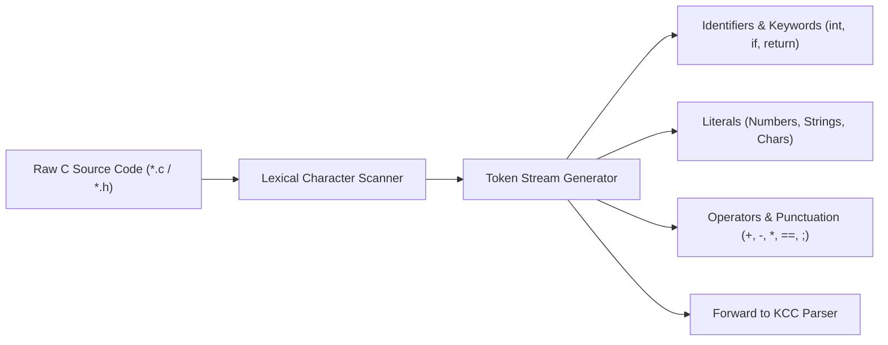

<!-- SPDX-License-Identifier: GPL-2.0-only -->

# KCC Lexer & Tokenizer

This document specifies lexical analysis, source tokenization, keyword recognition, and preprocessor directive handling in the Keira C Compiler (`kcc`).

---

## Lexer Tokenization Pipeline



---

## Technical Specifications

| Parameter | Specification | Description |
| :--- | :--- | :--- |
| **Max Token Length** | 128 characters | Identifier / string literal maximum length |
| **Numeric Bases** | Decimal, Hexadecimal (`0x`), Octal (`0`) | C numeric constant support |
| **Comments** | Single-line (`//`) and Multi-line (`/* ... */`) | Stripped during lexical scanning |

---

## Core Token Definitions (`user/apps/kcc/src/lexer.c`)

```c
typedef enum {
    TOK_EOF,
    TOK_INT, TOK_CHAR, TOK_VOID, TOK_RETURN,
    TOK_IF, TOK_ELSE, TOK_WHILE, TOK_FOR,
    TOK_IDENT, TOK_NUMBER, TOK_STRING_LIT,
    TOK_PLUS, TOK_MINUS, TOK_STAR, TOK_SLASH,
    TOK_EQUAL, TOK_EQ_EQ, TOK_NOT_EQ,
    TOK_SEMICOLON, TOK_LPAREN, TOK_RPAREN
} token_type_t;

void lexer_init(const char *source);
token_t lexer_next_token(void);
```
