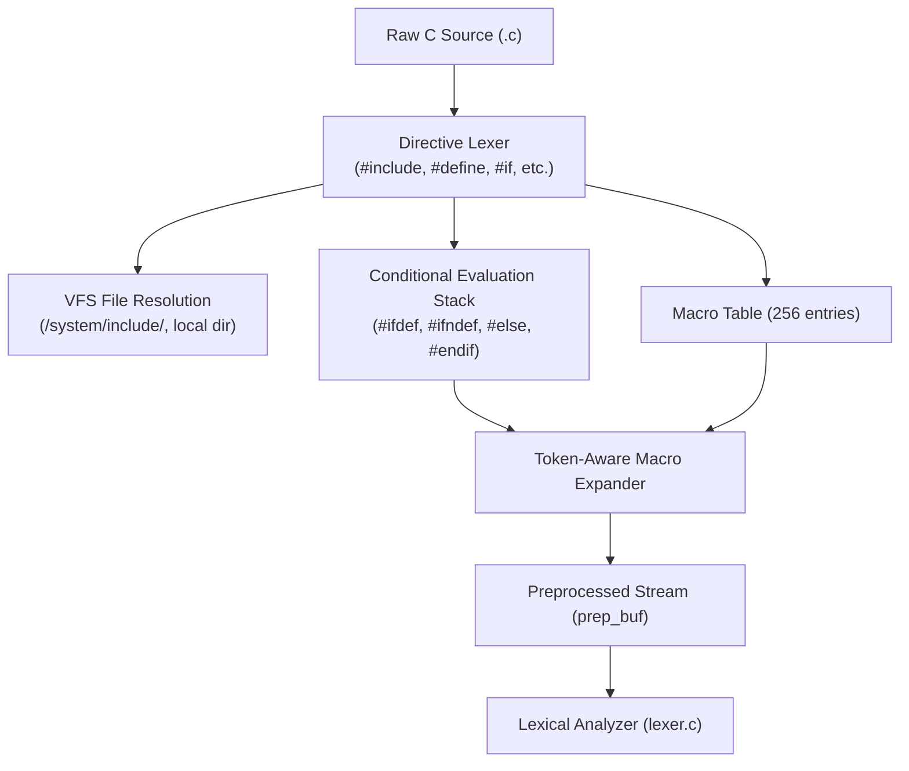

<!-- SPDX-License-Identifier: GPL-2.0-only -->

# KCC Preprocessor & Macro Engine (`preproc.c`)

This document details the architecture, directive processing, and macro substitution pipeline of the freestanding preprocessor in `kcc.elf`.

---

## Preprocessing Pipeline

The preprocessor executes as a dedicated pre-pass over the source buffer before the lexical analysis stage:

---

## Key Capabilities

### 1. Include Resolution (`#include`)
* **System Headers (`<...>`):** Automatically searched across `/system/include/` and `/system/include/sys/`.
* **Local Headers (`"..."`):** Resolved relative to the directory of the current source file, falling back to system include directories.
* **Recursion Guard:** Supports nested include files up to a depth of 8 levels (`MAX_INCLUDE_DEPTH`).
* **Memory Safety:** Uses per-level static `.bss` staging buffers without allocating large memory blocks on the Ring 3 stack.

### 2. Macro Definition & Expansion (`#define`, `#undef`)
* Stores macro identifiers and values in a fixed-size table (`MAX_MACROS = 256`).
* Distinguishes empty flag macros (`#define _HDR_H`) from value-bearing macros (`#define VAL 42`).
* Performs word-boundary substitution on active code tokens while strictly ignoring identifiers inside string literals (`"..."`) and character constants (`'...'`).

### 3. Conditional Compilation (`#ifdef`, `#ifndef`, `#if`, `#else`, `#endif`)
* Maintains a nested branch evaluation stack up to depth 16 (`MAX_IF_DEPTH`).
* Supports `#ifdef NAME` and `#ifndef NAME`.
* Supports `#if 1`, `#if 0`, `#if defined(NAME)`, and `#if !defined(NAME)`.

### 4. Built-in Target Macros
The preprocessor pre-defines standard compilation environment macros:
* `__KEIRA__`: Set to `1`.
* `__x86_64__`: Defined on 64-bit builds.
* `__i386__`: Defined on 32-bit builds.
* `NULL`: Defined as `0`.
