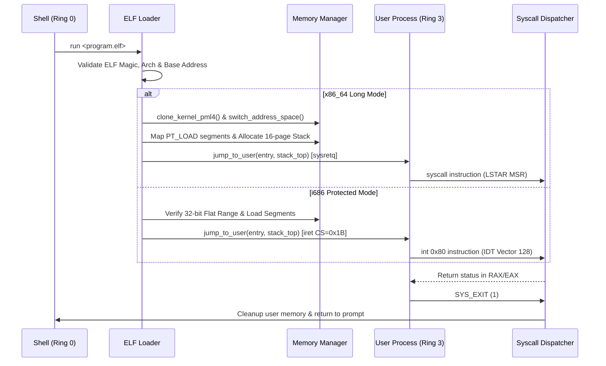

<!-- SPDX-License-Identifier: GPL-2.0-only -->

# Ring 3 ELF Execution & Memory Isolation

Keira Kernel provides hardware-enforced Ring 3 user mode isolation across both `x86_64` (64-bit Long Mode) and `i686` (32-bit Protected Mode) processor architectures.

---

## 1. Dual-Architecture Execution Matrix

| Architectural Feature | `x86_64` (Long Mode) | `i686` (Protected Mode) |
| :--- | :--- | :--- |
| **User Base Virtual Address** | `0x40000000` (1 GiB) | `0x01000000` (16 MiB) |
| **Address Space Isolation** | Isolated child PML4 (`vmm::clone_kernel_pml4()`) | Flat Ring 3 segments (`CS=0x1B`, `DS/SS=0x23`) |
| **User Stack Location** | `0x7FFFFFE00000` (16 pages allocated) | `0x07FFF000 - 16` (~128 MiB boundary) |
| **Ring 3 Transition** | `jump_to_user` (`sysretq` / `iretq`) | `jump_to_user` (`iret` with user GDT selectors) |
| **Kernel Syscall Entry** | LSTAR MSR (`syscall` instruction) | IDT Vector 128 / `0x80` (`int $0x80` instruction) |
| **Syscall ABI** | System V AMD64 (`RAX`, `RDI`, `RSI`, `RDX`, `R10`, `R8`) | Linux i386 (`EAX`, `EBX`, `ECX`, `EDX`, `ESI`, `EDI`) |

---

## 2. Execution Lifecycle

---

## 3. Security & Fault Handling

1. **W^X Enforcement (Write XOR Execute)**:
   - On `x86_64`, pages are mapped with standard `PAGE_PRESENT`, `PAGE_USER`, and optional `PAGE_WRITABLE` / `PAGE_NO_EXECUTE`.
2. **Page Fault & Exception Shielding**:
   - Exceptions occurring inside Ring 3 (General Protection Fault `#GP`, Page Fault `#PF`, Division by Zero `#DE`) are cleanly caught by kernel interrupt service routines and terminate the faulty user process without destabilizing the kernel.
3. **Safe Memory Validation (`user_copy`)**:
   - All pointer arguments passed into syscalls (`SYS_READ`, `SYS_WRITE`, `SYS_OPEN`) are validated against userland address boundaries before kernel dereferencing.

