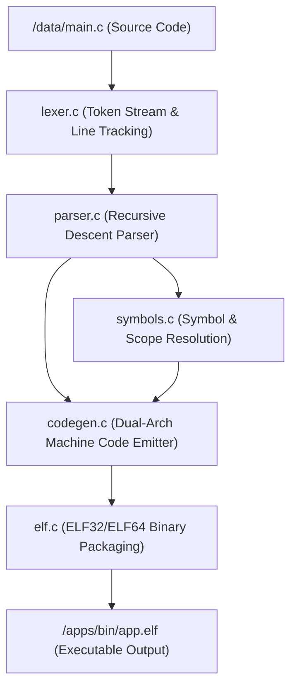

<!-- SPDX-License-Identifier: GPL-2.0-only -->

# In-Kernel KCC Compiler Toolchain

Keira Kernel includes a native freestanding in-kernel C compiler executable (`/system/bin/kcc.elf`) organized in a hyper-modular architecture under `user/bin/kcc/`. KCC compiles native C source code directly on Keira into Ring 3 ELF executables on both `x86_64` and `i686` architectures.

## Modular Architecture

```text
user/bin/kcc/
├── include/              # Private compiler declarations
│   ├── common.h          # Global compiler state, buffers & diagnostic helpers
│   ├── lexer.h           # Token types (TOK_*), scanner variables & token prototypes
│   ├── symbols.h         # Global/local symbol tables, address resolution & loop stacks
│   ├── codegen.h         # Dual-architecture machine code generator & ABI declarations
│   ├── parser.h          # Recursive descent expression & statement parser
│   └── elf.h             # ELF32/ELF64 binary generator prototypes
├── common.c              # Buffer allocations & diagnostic helpers
├── lexer.c               # Character scanner, string/number literals & line tracking
├── symbols.c             # Variable offsets, function addresses & relocation tables
├── codegen.c             # x86_64 / i686 instruction encoder, register management & jumps
├── parser.c              # AST parsing, operator precedence & control flow generation
├── elf.c                 # ELF32/ELF64 header, segment builder & binary writer
└── main.c                # Compiler entry point (`_start`), file I/O & pipeline driver
```

## Compilation Pipeline



## Architecture Matrix

| Target Architecture | Output Format | Base Virtual Address | Syscall Mechanism | Linker Script |
| :--- | :--- | :--- | :--- | :--- |
| **`x86_64`** | ELF64 Executable | `0x40000000` (1 GiB) | Native `syscall` / LSTAR | `user/arch/x86/linker.ld` |
| **`i686`** | ELF32 Executable | `0x01000000` (16 MiB) | `int $0x80` Interrupt Vector | `user/arch/x86/linker32.ld` |

## Supported Language Features & Syntax

| Category | Supported Syntax |
| :--- | :--- |
| **Data Types** | `int`, `char`, `short`, `long`, `unsigned`, `signed`, `void`, pointers (`*`) |
| **Arithmetic** | `+`, `-`, `*`, `/`, `%` (modulo) |
| **Bitwise** | `&` (AND), `|` (OR), `^` (XOR), `~` (NOT), `<<` (SHL), `>>` (SHR) |
| **Logical** | `&&` (AND), `||` (OR), `!` (NOT) |
| **Relational** | `<`, `>`, `<=`, `>=`, `==`, `!=` |
| **Assignments** | `=`, `+=`, `-=`, `*=`, `/=`, `%=`, `&=`, `|=`, `^=`, `<<=`, `>>=` |
| **Increment/Decrement** | `++var`, `--var`, `var++`, `var--` |
| **Pointers & Memory** | `&var` (address-of), `*ptr` (read/write dereference), `arr[i]` (byte/index addressing) |
| **Control Flow** | `if` / `else`, `while`, `for`, `do ... while`, `break;`, `continue;`, `return` |
| **ABI & Calls** | System V AMD64 ABI (x86_64) / cdecl stack parameters (i686), `syscall(...)` |
| **Built-ins** | `sizeof(type|var)`, `printf("format", ...)` |

## Compiler Execution

1. Place C source code into `/data/main.c` (or `/temp/main.c`):
   ```c
   #include <stdio.h>
   #include <syscall.h>

   int fib(int n) {
       if (n <= 1) return n;
       return fib(n - 1) + fib(n - 2);
   }

   void main(void) {
       printf("Keira KCC Compiler Demo\n");
       int i;
       for (i = 0; i < 10; i++) {
           printf("Fibonacci calculation complete.\n");
       }
   }
   ```
2. Execute the native compiler from the Keira shell:
   ```bash
   run /system/bin/kcc.elf
   ```
3. Execute the resulting compiled ELF binary in Ring 3 user mode:
   ```bash
   run /apps/bin/app.elf
   ```
