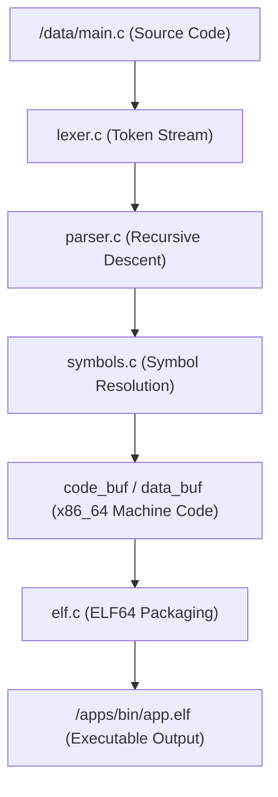

<!-- SPDX-License-Identifier: GPL-2.0-only -->

# In-Kernel KCC Compiler Toolchain

Keira Kernel includes a native freestanding in-kernel C compiler executable (`/apps/bin/kcc.elf`) organized in a hyper-modular architecture under `user/bin/kcc/`.

## Modular Architecture

```text
user/bin/kcc/
├── include/              # Private compiler declarations
│   ├── common.h          # Global compiler state, buffers & string helpers
│   ├── lexer.h           # Token types (TOK_*), scanner variables & token prototypes
│   ├── symbols.h         # Global/local symbol tables & patch tracking
│   ├── parser.h          # Recursive descent expression & statement parser
│   └── elf.h             # ELF64 binary generator prototypes
├── common.c              # Buffer allocations & formatted terminal printing
├── lexer.c               # Character scanner, string/number literals & keywords
├── symbols.c             # Variable offsets, function addresses & relocation tables
├── parser.c              # AST parsing, code emission & control flow generation
├── elf.c                 # ELF64 header, segment builder & binary writer
└── main.c                # Compiler entry point (`_start`), file I/O & pipeline driver
```

## Compilation Pipeline



## Compiler Execution

1. Place C source code into `/data/main.c` (e.g. using `kvi` or `edit`):
   ```c
   int main(void) {
       printf("Hello from Keira Kernel Ring 3 App!\n");
       return 0;
   }
   ```
2. Execute the native compiler from the Keira shell:
   ```bash
   run /apps/bin/kcc.elf
   ```
3. Execute the resulting compiled ELF64 binary:
   ```bash
   run /apps/bin/app.elf
   ```
