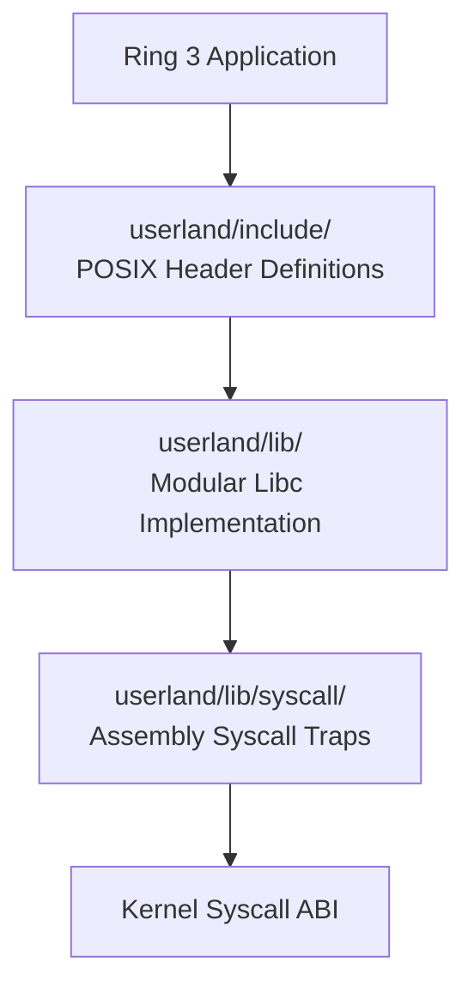

<!-- SPDX-License-Identifier: GPL-2.0-only -->

# Keira POSIX Standard C Library (`libc`)

Keira includes a modular C standard library (`userland/lib/` and `userland/include/`) supporting core ISO C and POSIX.1-2008 specifications.

---

## Module Structure

---

## Submodule Documents

| Document | Focus Area | Description |
| :--- | :--- | :--- |
| [`stdio.md`](stdio.md) | Standard I/O | Formatted streams, `printf`, `snprintf`, buffering, file I/O |
| [`stdlib.md`](stdlib.md) | General Utilities | Heap allocation (`malloc`, `free`), integer conversion, `exit` |
| [`string.md`](string.md) | String Manipulation | Memory operations (`memcpy`, `memset`), string searching and tokenization |
| [`unistd.md`](unistd.md) | POSIX Operating System | File descriptor manipulation, `read`, `write`, `close`, `fork`, `execve` |
| [`syscalls.md`](syscalls.md) | Syscall Wrappers | Architecture-specific assembly dispatchers (`int 0x80`, `syscall`) |
| [`math.md`](math.md) | Mathematical Functions | Floating-point and integer mathematical routines |
| [`mem.md`](mem.md) | Memory Management | Userland memory allocators and page-level mapping interfaces (`mmap`) |
| [`socket.md`](socket.md) | BSD Socket API | Socket creation, `bind`, `connect`, `listen`, `send`, `recv` |
| [`time.md`](time.md) | Time & Clocks | Real-time clock access, `nanosleep`, `clock_gettime` |
| [`termios.md`](termios.md) | Terminal Control | Raw/canonical mode configuration, baud rates, echo control |
| [`signal.md`](signal.md) | Signal Handling | Signal installation (`sigaction`, `signal`), mask manipulation |
