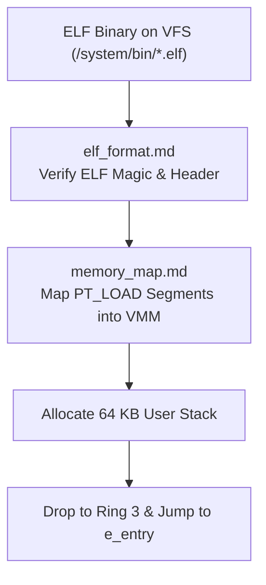

<!-- SPDX-License-Identifier: GPL-2.0-only -->

# Dynamic ELF64 Binary Loader

This submodule details the 64-bit Executable and Linkable Format (ELF) binary loader in Keira Kernel.

---

## Loading Pipeline

---

## Loader Submodule Index

| Document | Topic | Description |
| :--- | :--- | :--- |
| [`elf_format.md`](elf_format.md) | ELF Header Specifications | ELF magic (`0x7F 'E' 'L' 'F'`), 64-bit header fields, and program headers |
| [`memory_map.md`](memory_map.md) | Segment Memory Mapping | Virtual memory mapping of `PT_LOAD` segments with `R/W/X` permission bits |
