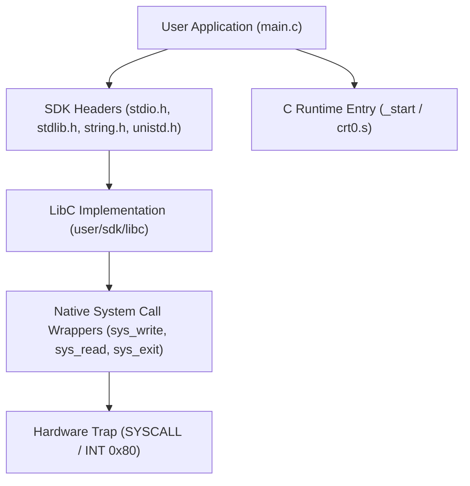

<!-- SPDX-License-Identifier: GPL-2.0-only -->

# Keira Native C Software Development Kit (SDK)

The Keira SDK provides standard C library (libc) headers, runtime startup routines (`crt0.o`), and system call wrappers for developing Ring 3 userland applications.

---

## SDK Architecture

---

## SDK Module Index

| Header | Document | Primary Functions |
| :--- | :--- | :--- |
| `<stdio.h>` | [`stdio.md`](stdio.md) | `printf`, `puts`, `putchar`, `fopen`, `fread`, `fwrite`, `fclose` |
| `<stdlib.h>` | [`stdlib.md`](stdlib.md) | `malloc`, `free`, `exit`, `atoi`, `rand`, `system` |
| `<string.h>` | [`string.md`](string.md) | `strlen`, `strcpy`, `strcmp`, `memcpy`, `memset`, `strcat` |
| `<ctype.h>` | [`ctype.md`](ctype.md) | `isalpha`, `isdigit`, `isalnum`, `isspace`, `toupper`, `tolower` |
| `<math.h>` | [`math.md`](math.md) | `sqrt`, `sin`, `cos`, `pow`, `abs`, `floor`, `ceil` |
| `<syscall.h>` | [`syscalls.md`](syscalls.md) | Direct kernel system call wrappers and errno declarations |
