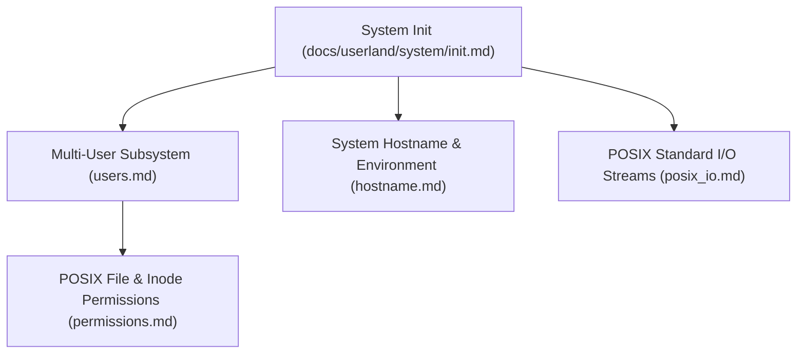

<!-- SPDX-License-Identifier: GPL-2.0-only -->

# System Daemons, Users & Environment Configuration

This directory details userland system initialization (`init`), multi-user authentication (`users`), POSIX permission enforcement, host configuration, and standard I/O in Keira Kernel.

---

## Userland System Subsystem Architecture

---

## System Subsystem Index

| Document | Topic | Description |
| :--- | :--- | :--- |
| [`init.md`](init.md) | Userland Init Stage | Early userland bootstrap, root filesystem mount, and daemon startup |
| [`users.md`](users.md) | Multi-User Management | User accounts (`/config/passwd`), UID/GID mappings, and sessions |
| [`permissions.md`](permissions.md) | POSIX Permissions | Standard `rwxrwxrwx` octal mode bits, `chmod`, and ownership |
| [`hostname.md`](hostname.md) | System Hostname | Node name resolution, `/config/hostname`, and runtime configuration |
| [`posix_io.md`](posix_io.md) | POSIX File I/O | Standard streams (`stdin`, `stdout`, `stderr`) and descriptor tables |
