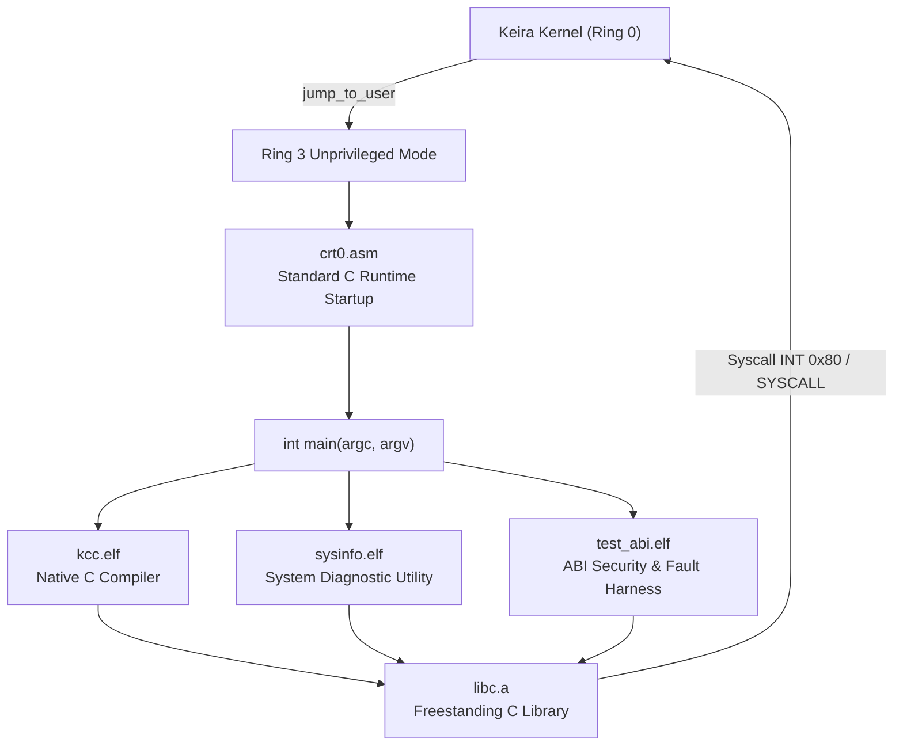

<!-- SPDX-License-Identifier: GPL-2.0-only -->

# Ring 3 Native Userland Binaries

Keira Kernel provides native freestanding ELF binaries running strictly in unprivileged CPU privilege mode (Ring 3). These binaries link against the freestanding C runtime archive (`libc.a`) using standard architecture-isolated C runtime startup routines (`user/arch/x86/*/crt0.asm`) and linker scripts (`user/arch/x86/*/linker.ld`).

---

## Userland Binary Ecosystem



---

## Binary Catalog

| Binary | Location | Primary Syscalls Used | Purpose |
| :--- | :--- | :--- | :--- |
| `kcc.elf` | `/system/bin/kcc.elf`, `/apps/bin/kcc.elf` | `SYS_OPEN`, `SYS_READ`, `SYS_WRITE`, `SYS_BRK`, `SYS_EXIT` | Self-hosting C compiler generating ELF binaries |
| `sysinfo.elf` | `/system/bin/sysinfo.elf`, `/apps/bin/sysinfo.elf` | `SYS_GETPID`, `SYS_UPTIME`, `SYS_OPEN`, `SYS_READ`, `SYS_WRITE`, `SYS_EXIT` | Ring 3 system and process state diagnostic utility |
| `test_abi.elf` | `/system/bin/test_abi.elf`, `/apps/bin/test_abi.elf` | `SYS_GETPID`, `SYS_GETPPID`, `SYS_CHDIR`, `SYS_GETCWD`, `SYS_LSEEK`, `SYS_SOCKET`, `SYS_CONNECT`, `SYS_BRK`, `SYS_MMAP`, `SYS_MUNMAP`, `SYS_MPROTECT`, `SYS_MSYNC`, `SYS_PIPE`, `SYS_FORK`, `SYS_WAITPID`, `SYS_SIGACTION`, `SYS_SIGRETURN`, `SYS_SIGPROCMASK`, `SYS_SIGPENDING`, `SYS_GETUID`, `SYS_SETUID`, `SYS_IOCTL`, `SYS_SYNC`, `SYS_FSYNC`, `SYS_DUP`, `SYS_DUP2`, `SYS_EXIT`, `SYS_WRITE`, `SYS_READ` | Ring 3 syscall security and fault-injection verification harness (37 tests) |

---

## Standard C Runtime Startup (`crt0.asm`)

All userland binaries execute through an austere, standards-compliant `crt0` startup module (`user/arch/x86/x86_64/crt0.asm` and `user/arch/x86/i686/crt0.asm`):

1. **Stack Unwrapping**: Unpacks `argc`, `argv`, and `envp` passed on the initial user stack by the kernel's ELF execution pipeline (`run.rs`).
2. **Environment Initializer**: Initializes the global `char **environ;` pointer directly from `envp` before application execution.
3. **Alignment Guarantee**: Enforces 16-byte stack boundary alignment before invoking application code.
4. **Automatic Exit Dispatch**: Calls `main(argc, argv, envp)` and forwards the return status to `exit()` automatically upon completion.

---

## Ring 3 Diagnostics (`sysinfo.elf`)

The diagnostic utility queries kernel state through standard system call interfaces and the virtual filesystem:

```c
#include <stdio.h>
#include <stdlib.h>
#include <string.h>
#include <syscall.h>
#include <unistd.h>

int main(int argc, char **argv) {
    (void)argc;
    (void)argv;

    puts("Keira Ring 3 Diagnostic Utility (sysinfo)");

    pid_t pid = sys_getpid();
    printf("Process ID (PID)      : %d (Ring 3 unprivileged mode)\n", (int)pid);

    time_t uptime = sys_uptime();
    printf("System Uptime         : %d seconds\n", (int)uptime);

    /* Read kernel hostname from VFS */
    int fd = sys_open("/config/sys/hostname.cfg", 0, 0);
    if (fd >= 0) {
        char host_buf[64];
        memset(host_buf, 0, sizeof(host_buf));
        ssize_t n = sys_read(fd, host_buf, sizeof(host_buf) - 1);
        sys_close(fd);
        if (n > 0) {
            if (host_buf[n - 1] == '\n') {
                host_buf[n - 1] = '\0';
            }
            printf("Kernel Hostname       : %s\n", host_buf);
        }
    }

    puts("[OK] System info query completed successfully.");
    return 0;
}
```

---

## Ring 3 Syscall Security & Fault Harness (`test_abi.elf`)

The security harness verifies that the kernel's memory isolation, pointer validation (`validate_user_ptr`), file descriptor bounds checking, and directory tracking prevent user-induced kernel faults:

```text
admin@keira:~$ run /system/bin/test_abi.elf
Loading ELF binary: /system/bin/test_abi.elf
Keira Ring 3 Syscall Security & ABI Verification Harness
  [TEST] Process identity: PID=0, PPID=0
  [OK]   Process identity verified
  [TEST] Kernel address pointer isolation (EFAULT check)...
  [OK]   Kernel space boundary validated (EFAULT enforced)
  [TEST] NULL pointer dereference protection...
  [OK]   NULL pointer isolation validated (EFAULT enforced)
  [TEST] Invalid file descriptor validation...
  [OK]   Out-of-bounds file descriptors rejected (EBADF enforced)
  [TEST] VFS working directory tracking...
  [INFO] Changed working directory to: /config
  [OK]   VFS working directory tracking operational
  [TEST] VFS file seeking (lseek)...
  [OK]   VFS seek pointer operational
  [TEST] BSD socket lifecycle & async stream dispatch...
  [INFO] Allocated socket descriptor: fd=3
  [INFO] Socket connected to remote endpoint
  [INFO] Transmitted 4 stream payload bytes
  [OK]   BSD socket subsystem operational
  [TEST] VMM demand paging & lazy heap (sbrk) allocation...
  [INFO] Lazy pages faulted in transparently via #PF
  [OK]   VMM demand paging operational
  [TEST] Out-of-bounds syscall safety check...
  [OK]   Undefined syscall safely handled without kernel fault
  [TEST] Buffered standard I/O stream operations...
  [INFO] Read stream line: "keira"
  [INFO] Stream seek & single-byte cache hit verified
  [OK]   Buffered standard I/O operational
  [TEST] Dual-tier memory allocator (heap & mmap tiers)...
  [INFO] Heap tier forward coalescing validated
  [INFO] Mmap tier 256 KiB allocation validated
  [INFO] Mmap tier deallocation validated
  [OK]   Dual-tier memory allocator operational
  [TEST] Environment variable operations (getenv, setenv, unsetenv)...
  [INFO] Environment variable set and read: "userland_active"
  [INFO] Environment variable unset validated
  [OK]   Environment variable subsystem operational
  [TEST] Stream formatting & string scanning (fprintf, sscanf)...
  [INFO] sscanf parsed 2 tokens: id=42 name="keira_proc"
  [INFO] fprintf stream output verified
  [OK]   Stream formatting and string parsing operational
  [TEST] Ring 3 multiprocess orchestration (fork + waitpid)...
  [INFO] Child PID 1 reaped with exit status 42
  [OK]   Ring 3 process orchestration operational
  [TEST] Anonymous inter-process pipe streaming (pipe + fork + IPC)...
  [INFO] Received pipe message: "KEIRA_PIPE_STREAM_OK"
  [OK]   Anonymous pipe inter-process streaming operational
  [TEST] Copy-on-Write (COW) memory mutation isolation...
  [INFO] Parent memory unchanged after child mutation (COW verified)
  [OK]   Copy-on-Write memory mutation isolation operational
  [TEST] Multi-process tree reaping & zombie status propagation...
  [INFO] 3 child processes reaped with exact exit codes (11, 22, 33)
  [OK]   Process tree reaping and zombie status propagation operational
  [TEST] Cross-architecture high kernel pointer rejection...
  [INFO] Syscall write/read to high kernel pointer strictly rejected
  [OK]   Cross-architecture kernel boundary security verified
  [TEST] Process credentials and privilege demotion (getuid/setuid)...
  [INFO] Successfully demoted to UID 1000 and blocked escalation to UID 0 (EPERM)
  [OK]   Process credentials and privilege demotion operational
  [TEST] POSIX signal context registration and sigreturn verification...
  [INFO] Signal handler registered, signal context saved, and restored via sigreturn
  [OK]   POSIX signal context delivery and sigreturn restorer operational
  [TEST] Character device /system/dev/tty stream read/write...
[TTY_ECHO_OK]
  [INFO] /system/dev/tty write and non-blocking read queue drain verified
  [OK]   Character device /system/dev/tty stream operational
  [TEST] TTY line discipline and termios mode switching...
  [INFO] Termios TCGETS and TCSETS attribute persistence verified
  [OK]   TTY line discipline and termios mode switching operational
  [TEST] POSIX signal masking (sigprocmask/sigpending)...
  [INFO] Masked signal blocked, queued, and delivered on unblock
  [OK]   POSIX signal masking and pending queue operational
  [TEST] ProcFS dynamic telemetry and DevFS isolation...
  [INFO] ProcFS metrics and DevFS dynamic nodes verified
  [OK]   Dynamic pseudo-filesystem operational
  [TEST] Stack canary protection and argument ABI...
  [INFO] Stack canary guard initialized (0xaaf338434ec3ca2c), argc=1, argv[0]=/system/bin/test_abi.elf
  [OK]   Stack canary protection and argument ABI operational
  [TEST] File-backed mmap, demand paging, and msync synchronization...
  [INFO] Demand paging verified: read 'INIT_PAYLOAD_KEIRA_MMAP_PERSISTENCE_TEST'
  [INFO] Disk persistence confirmed: 'DONE_PAYLOAD_KEIRA_MMAP_PERSISTENCE_TEST'
  [OK]   File-backed mmap, demand paging, and msync synchronization operational
  [TEST] Illegal instruction (#UD) fault containment and SIGILL delivery...
  [INFO] Child PID 4 trapped #UD, terminated by signal 4 (SIGILL)
  [OK]   Illegal instruction hardware exception safely trapped to SIGILL
  [TEST] Division by zero (#DE) fault containment and SIGFPE delivery...
  [INFO] Child PID 5 trapped #DE, terminated by signal 8 (SIGFPE)
  [OK]   Division by zero hardware exception safely trapped to SIGFPE
  [TEST] Memory dereference fault containment and SIGSEGV delivery...
  [INFO] Child PID 6 trapped #PF, terminated by signal 11 (SIGSEGV)
  [OK]   Memory dereference hardware exception safely trapped to SIGSEGV
  [TEST] Demand-paged VMA memory validation across syscall boundaries...
  [OK]   Demand-paged VMA populated and validated in syscall copy without EFAULT
  [TEST] Persistent core dump diagnostic artifact inspection...
  [INFO] Core dump /data/log/core_6.dmp verified (found 'KEIRA CORE DUMP')
  [OK]   Persistent core dump diagnostic generation operational
  [TEST] Rapid process fork & reap churn (20 iterations)...
  [INFO] 20 sequential processes spawned, executed, and reaped cleanly
  [OK]   Rapid fork and reap churn completed with zero slot or memory leaks
  [TEST] Orphan process reparenting and PID 0 adoption lifecycle...
  [INFO] Orphaned grandchild confirmed adopted by PID 0 and reaped cleanly
  [OK]   Orphan process reparenting and PID 0 adoption lifecycle operational
  [TEST] File descriptor and write lock auto-reclaim upon process exit...
  [INFO] File write lock successfully re-acquired immediately after unclosed child exit
  [OK]   File descriptor and write lock auto-reclaim operational
  [TEST] File system and hardware storage cache synchronization...
  [INFO] Hardware ATA write cache flush and sector barrier verified
  [OK]   File system and hardware cache synchronization operational
  [TEST] POSIX descriptor duplication and targeting (dup & dup2)...
  [INFO] Independent file handle targeting and lifecycle verified
  [OK]   Descriptor duplication and explicit slot targeting operational
  [TEST] Descriptor advisory lock coherency across duplicated handles...
  [INFO] Closing duplicated handle preserved lock until final handle closure
  [OK]   Advisory write lock coherency across duplicated descriptors verified
  [TEST] Multi-process concurrent syscall & memory stress...
  [INFO] Concurrent heap mutations and pipe transfers completed without corruption
  [OK]   Multi-process concurrent syscall & memory stress verified
  [TEST] Lock contention & non-blocking deadlock immunity...
  [INFO] Lock contention correctly rejected with EACCES without scheduler deadlock
  [OK]   Lock contention & non-blocking deadlock immunity verified

[DONE] All Ring 3 Syscall Security & Fault Injection tests PASSED.
Program exited normally.
admin@keira:~$
```


