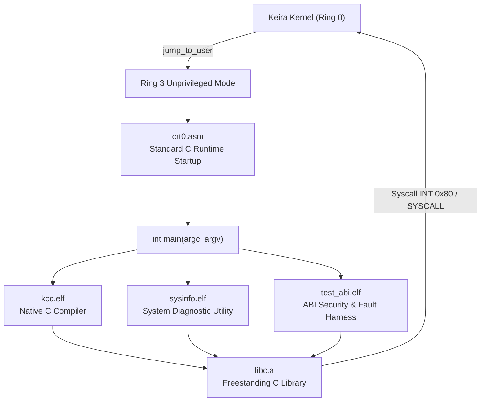

<!-- SPDX-License-Identifier: GPL-2.0-only -->

# Ring 3 Native Userland Binaries

Keira Kernel provides native freestanding ELF binaries running strictly in unprivileged CPU privilege mode (Ring 3). These binaries link against the freestanding C runtime archive (`libc.a`) using standard architecture-isolated C runtime startup routines (`user/arch/x86/*/crt0.asm`) and linker scripts (`user/arch/x86/*/linker.ld`).

---

## Userland Binary Ecosystem



---

## Binary Catalog

| Binary | Location | Primary Syscalls Used | Purpose |
| :--- | :--- | :--- | :--- |
| `kcc.elf` | `/system/bin/kcc.elf`, `/apps/bin/kcc.elf` | `SYS_OPEN`, `SYS_READ`, `SYS_WRITE`, `SYS_BRK`, `SYS_EXIT` | Self-hosting C compiler generating ELF binaries |
| `sysinfo.elf` | `/system/bin/sysinfo.elf`, `/apps/bin/sysinfo.elf` | `SYS_GETPID`, `SYS_UPTIME`, `SYS_OPEN`, `SYS_READ`, `SYS_WRITE`, `SYS_EXIT` | Ring 3 system and process state diagnostic utility |
| `test_abi.elf` | `/system/bin/test_abi.elf`, `/apps/bin/test_abi.elf` | `SYS_GETPID`, `SYS_GETPPID`, `SYS_CHDIR`, `SYS_GETCWD`, `SYS_LSEEK`, `SYS_SOCKET`, `SYS_WRITE` | Ring 3 syscall security and fault-injection verification harness |

---

## Standard C Runtime Startup (`crt0.asm`)

All userland binaries execute through an austere, standards-compliant `crt0` startup module (`user/arch/x86/x86_64/crt0.asm` and `user/arch/x86/i686/crt0.asm`):

1. **Stack Unwrapping**: Unpacks `argc`, `argv`, and `envp` passed on the initial user stack by the kernel's ELF execution pipeline (`run.rs`).
2. **Alignment Guarantee**: Enforces 16-byte stack boundary alignment before invoking application code.
3. **Automatic Exit Dispatch**: Calls `main(argc, argv, envp)` and forwards the return status to `exit()` automatically upon completion.

---

## Ring 3 Diagnostics (`sysinfo.elf`)

The diagnostic utility queries kernel state through standard system call interfaces and the virtual filesystem:

```c
#include <stdio.h>
#include <stdlib.h>
#include <string.h>
#include <syscall.h>
#include <unistd.h>

int main(int argc, char **argv) {
    (void)argc;
    (void)argv;

    puts("Keira Ring 3 Diagnostic Utility (sysinfo)");

    pid_t pid = sys_getpid();
    printf("Process ID (PID)      : %d (Ring 3 unprivileged mode)\n", (int)pid);

    time_t uptime = sys_uptime();
    printf("System Uptime         : %d seconds\n", (int)uptime);

    /* Read kernel hostname from VFS */
    int fd = sys_open("/config/sys/hostname.cfg", 0, 0);
    if (fd >= 0) {
        char host_buf[64];
        memset(host_buf, 0, sizeof(host_buf));
        ssize_t n = sys_read(fd, host_buf, sizeof(host_buf) - 1);
        sys_close(fd);
        if (n > 0) {
            if (host_buf[n - 1] == '\n') {
                host_buf[n - 1] = '\0';
            }
            printf("Kernel Hostname       : %s\n", host_buf);
        }
    }

    puts("[OK] System info query completed successfully.");
    return 0;
}
```

---

## Ring 3 Syscall Security & Fault Harness (`test_abi.elf`)

The security harness verifies that the kernel's memory isolation, pointer validation (`validate_user_ptr`), file descriptor bounds checking, and directory tracking prevent user-induced kernel faults:

```text
admin@keira:~$ run /system/bin/test_abi.elf
Loading ELF binary: /system/bin/test_abi.elf
Keira Ring 3 Syscall Security & ABI Verification Harness
  [TEST] Process identity: PID=0, PPID=0
  [OK]   Process identity verified
  [TEST] Kernel address pointer isolation (EFAULT check)...
  [OK]   Kernel space boundary validated (EFAULT enforced)
  [TEST] NULL pointer dereference protection...
  [OK]   NULL pointer isolation validated (EFAULT enforced)
  [TEST] Invalid file descriptor validation...
  [OK]   Out-of-bounds file descriptors rejected (EBADF enforced)
  [TEST] VFS working directory tracking...
  [INFO] Changed working directory to: /config
  [OK]   VFS working directory tracking operational
  [TEST] VFS file seeking (lseek)...
  [OK]   VFS seek pointer operational
  [TEST] BSD socket creation via SYS_SOCKET...
  [INFO] Created IPv4 TCP socket handle: fd=6
  [OK]   Socket ABI boundary validated
  [TEST] Out-of-bounds syscall safety check...
  [OK]   Undefined syscall safely handled without kernel fault

[DONE] All Ring 3 Syscall Security & Fault Injection tests PASSED.
Program exited normally.
admin@keira:~$
```
