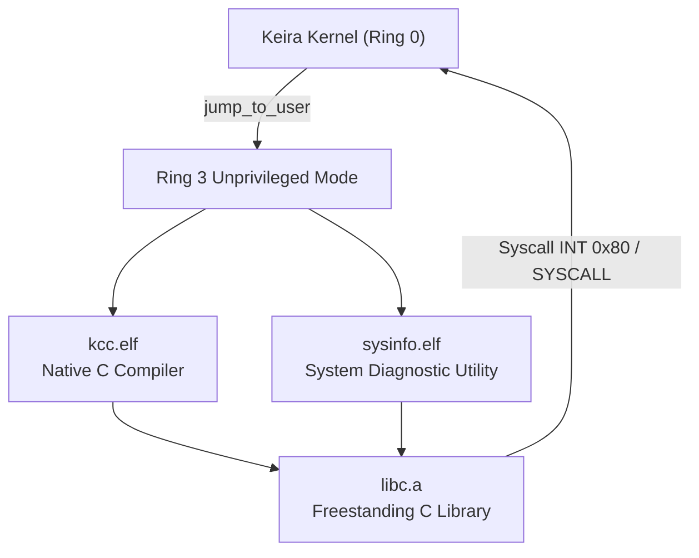

<!-- SPDX-License-Identifier: GPL-2.0-only -->

# Ring 3 Native Userland Binaries

Keira Kernel provides native freestanding ELF binaries running strictly in unprivileged CPU privilege mode (Ring 3). These binaries link against the freestanding C runtime archive (`libc.a`) using architecture-isolated linker scripts (`user/arch/x86/`).

---

## Userland Binary Ecosystem



---

## Binary Catalog

| Binary | Location | Primary Syscalls Used | Purpose |
| :--- | :--- | :--- | :--- |
| `kcc.elf` | `/system/bin/kcc.elf`, `/apps/bin/kcc.elf` | `SYS_OPEN`, `SYS_READ`, `SYS_WRITE`, `SYS_BRK`, `SYS_EXIT` | Self-hosting C compiler generating ELF binaries |
| `sysinfo.elf` | `/system/bin/sysinfo.elf`, `/apps/bin/sysinfo.elf` | `SYS_GETPID`, `SYS_UPTIME`, `SYS_OPEN`, `SYS_READ`, `SYS_WRITE`, `SYS_EXIT` | Ring 3 system and process state diagnostic utility |

---

## Ring 3 Diagnostics (`sysinfo.elf`)

The diagnostic utility queries kernel state through standard system call interfaces and the virtual filesystem:

```c
#include <stdio.h>
#include <stdlib.h>
#include <string.h>
#include <syscall.h>
#include <unistd.h>

void _start(int argc, char **argv) {
    (void)argc;
    (void)argv;

    puts("Keira Ring 3 Diagnostic Utility (sysinfo)");

    pid_t pid = sys_getpid();
    printf("Process ID (PID)      : %d (Ring 3 unprivileged mode)\n", (int)pid);

    time_t uptime = sys_uptime();
    printf("System Uptime         : %d seconds\n", (int)uptime);

    /* Read kernel hostname from VFS */
    int fd = sys_open("/config/sys/hostname.cfg", 0, 0);
    if (fd >= 0) {
        char host_buf[64];
        memset(host_buf, 0, sizeof(host_buf));
        ssize_t n = sys_read(fd, host_buf, sizeof(host_buf) - 1);
        sys_close(fd);
        if (n > 0) {
            if (host_buf[n - 1] == '\n') {
                host_buf[n - 1] = '\0';
            }
            printf("Kernel Hostname       : %s\n", host_buf);
        }
    }

    puts("[OK] System info query completed successfully.");
    sys_exit(0);
}
```

---

## Invocation from Kernel Shell

From the interactive kernel shell prompt:

```text
admin@keira:~$ run /system/bin/sysinfo.elf
Loading ELF binary: /system/bin/sysinfo.elf
Keira Ring 3 Diagnostic Utility (sysinfo)
Process ID (PID)      : 0 (Ring 3 unprivileged mode)
System Uptime         : 5503 seconds
Kernel Hostname       : keira
[OK] System info query completed successfully.
Program exited normally.
admin@keira:~$
```
