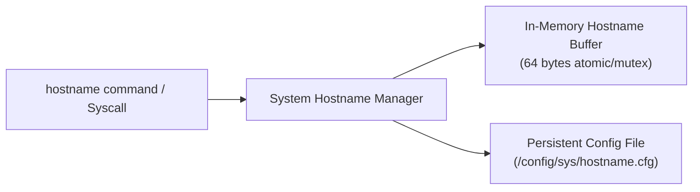

<!-- SPDX-License-Identifier: GPL-2.0-only -->

# System Hostname & Network Identity

This document details hostname configuration, persistent storage serialization, and network identity management in Keira Kernel.

---

## Subsystem Architecture



---

## Technical Specifications

* **Buffer Capacity**: 64 bytes (UTF-8, null-terminated).
* **Default Hostname**: `keira`.
* **Persistence Path**: `/config/sys/hostname.cfg` on the primary FAT16 partition.

---

## Core API (`crates/task/src/security/mod.rs`)

```rust
/// Query the current system network hostname.
pub fn get_hostname() -> &'static str;

/// Update the system hostname in RAM and commit to persistent disk storage.
pub fn set_hostname(name: &str) -> Result<(), &'static str>;
```

---

## Interactive Shell Usage

```bash
# Display current system hostname
keira> hostname
keira

# Update system hostname
keira> hostname set titan-node1
Hostname updated to 'titan-node1' (saved to /config/sys/hostname.cfg)
```
