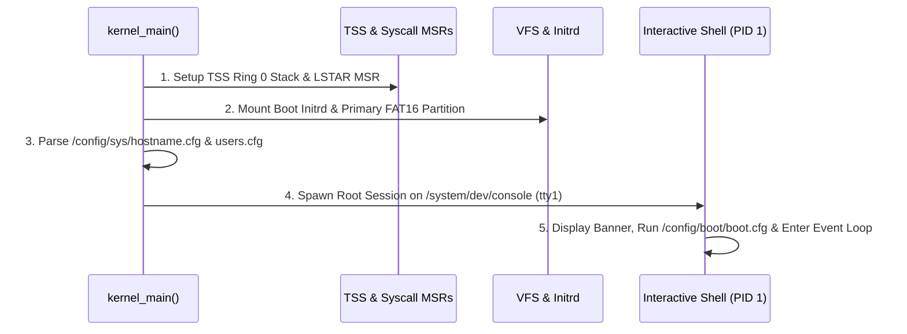

<!-- SPDX-License-Identifier: GPL-2.0-only -->

# System Initialization & Userland Process Bootstrap

This document details the userland process initialization pipeline, root process spawning, and runtime environment preparation in Keira Kernel.

---

## Initialization Pipeline

---

## Userland Runtime Environment

When userland applications are launched, the kernel prepares a dedicated execution context:
1. **Isolated Address Space**: Private PML4 page table mapping user memory below `0x0000_7FFF_FFFF_FFFF`.
2. **Userland Stack**: 64 KB user stack (`RSP` pointing to top of stack).
3. **Privilege Transition**: Drops CPU privilege level from Ring 0 to Ring 3 using `sysretq` (64-bit) or `iret` (32-bit).

---

## Startup Configuration Scripts

| Configuration File | Path | Description |
| :--- | :--- | :--- |
| **Boot Script** | `/config/boot/boot.cfg` | Shell script executed automatically during early user session startup |
| **System Release** | `/config/sys/os-release` | Kernel release, version string, and architecture identity |
| **User Database** | `/config/sys/users.cfg` | User accounts, UID/GID assignments, and password hashes |
