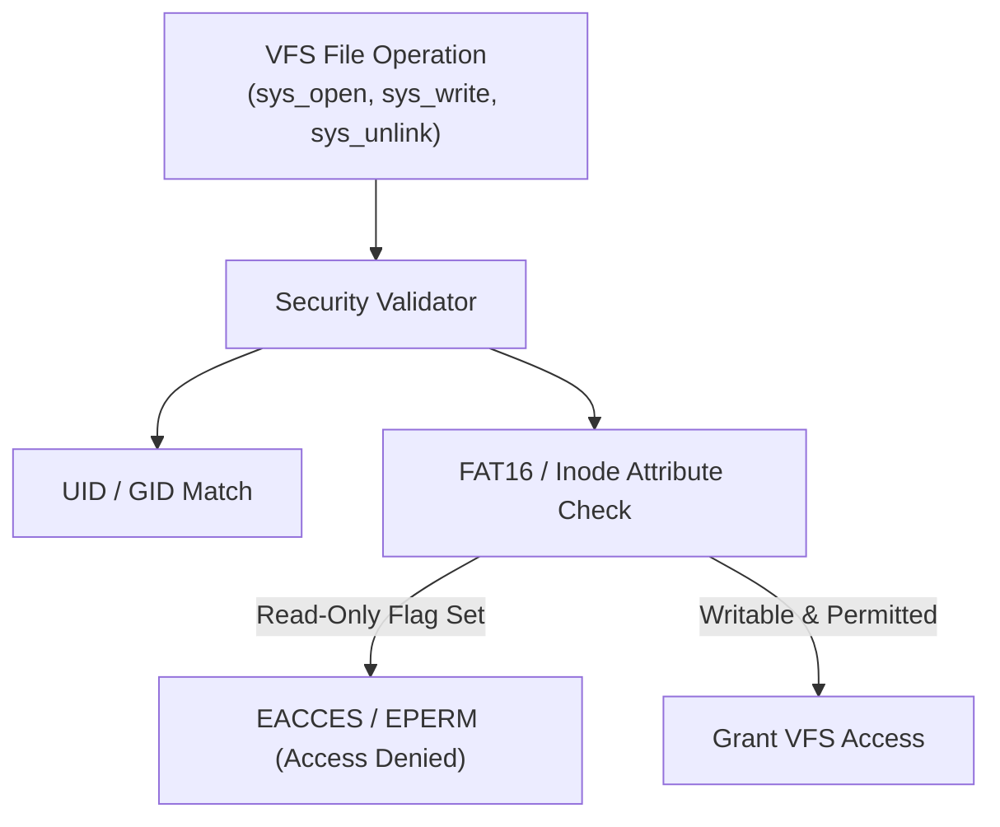

<!-- SPDX-License-Identifier: GPL-2.0-only -->

# POSIX File Security & Protection Flags

This document details file attribute security, read-only protection bits, and access control validation in Keira Kernel.

---

## File Permission & Attribute Model



---

## Attribute & Permission Flags

| Attribute Bit | Constant | Value | Description |
| :--- | :--- | :--- | :--- |
| **Read-Only** | `ATTR_READ_ONLY` | `0x01` | Prevents writing, truncation, or deletion |
| **Hidden** | `ATTR_HIDDEN` | `0x02` | Hides file from standard directory listings |
| **System** | `ATTR_SYSTEM` | `0x04` | Marks file as critical operating system component |
| **Directory** | `ATTR_DIRECTORY` | `0x10` | Identifies subdirectory node |
| **Archive** | `ATTR_ARCHIVE` | `0x20` | Backup archive status flag |

---

## Core API (`crates/fs/src/fat/mod.rs`)

```rust
/// Set or clear read-only file protection on a target path.
pub fn set_file_protection(path: &str, readonly: bool) -> Result<(), &'static str>;

/// Verify caller permissions before granting write/unlink access.
pub fn check_permission(path: &str, is_write: bool, caller_uid: u32) -> Result<(), &'static str>;
```
