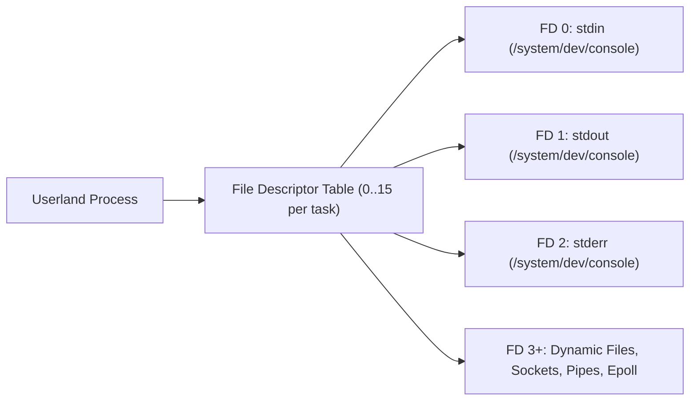

<!-- SPDX-License-Identifier: GPL-2.0-only -->

# POSIX File Descriptors & Stream I/O

This document specifies the POSIX file descriptor table, standard streams (`stdin`, `stdout`, `stderr`), and stream I/O semantics in Keira Kernel.

---

## File Descriptor Hierarchy



---

## Access Mode Flags (`sys/fcntl.h`)

| Constant | Value | Description |
| :--- | :--- | :--- |
| `O_RDONLY` | `0` | Open file for reading only |
| `O_WRONLY` | `1` | Open file for writing only |
| `O_RDWR` | `2` | Open file for both reading and writing |
| `O_CREAT` | `64` | Create file if it does not already exist |
| `O_TRUNC` | `512` | Truncate file length to 0 on open |
| `O_APPEND` | `1024` | Force all write operations to seek to the end of file |

---

## Standard Stream System Calls

```rust
pub fn sys_open(path: *const u8, flags: i32, mode: u32) -> Result<u32, u64>;
pub fn sys_read(fd: u32, buf: *mut u8, count: usize) -> Result<usize, u64>;
pub fn sys_write(fd: u32, buf: *const u8, count: usize) -> Result<usize, u64>;
pub fn sys_lseek(fd: u32, offset: i64, whence: i32) -> Result<i64, u64>;
pub fn sys_close(fd: u32) -> Result<(), u64>;
```
