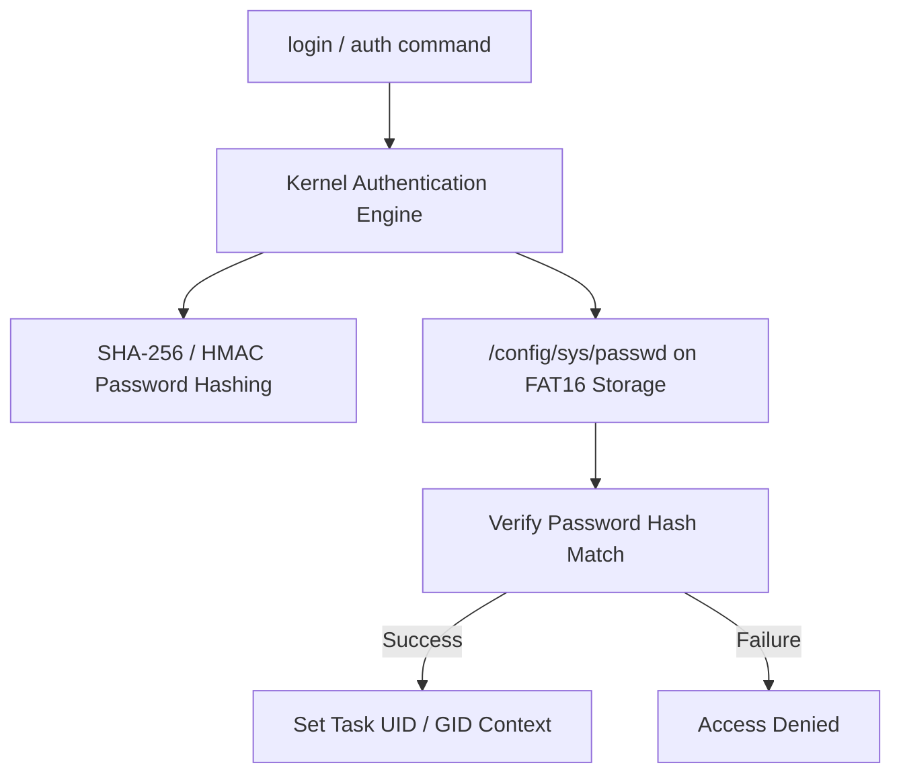

<!-- SPDX-License-Identifier: GPL-2.0-only -->

# Multi-User Accounts & Authentication Subsystem

This document details user account management, password hashing, credential verification, and user sessions in Keira Kernel.

---

## Authentication Architecture



---

## User Database File Format (`/config/sys/passwd`)

```text
username:password
admin:keira
```

---

## Core API (`crates/task/src/security/mod.rs`)

```rust
/// Validate user credentials against persistent password database.
pub fn authenticate_user(user: &str, pass: &str) -> bool;

/// Query UID and GID for a target username.
pub fn get_user_id(username: &str) -> Option<(u32, u32)>;
```
